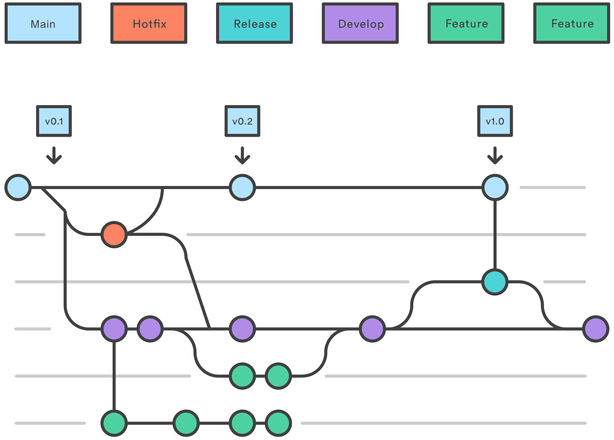

# GitFlow

## Branches

- ***main***: The purpose is to contain production-ready code that can be released.
  - ***hotfix***: It’s used to quickly address necessary changes in your main branch.
      - *Nomenclature*
    
      ```bash
         hotfix-25-css-not-working
       ```
- ***release***: Should be used when preparing new production releases. Typically, the work being performed on release branches concerns finishing touches and minor bugs specific to releasing new code.
- ***develop***: It’s created at the start of a project and is maintained throughout the development process, and contains pre-production code with newly developed features that are in the process of being tested.
- ***feature***: It’s the most common type of branch in the Git flow workflow. It is used when adding new features to your code.
    - *Nomenclature*
    
        ```bash
        admin-65-add-form-schedule-movie
        or
        general-54-add-form-register-basic-user
        ```


## Graphic



## Pull Request

## Approve and Merge

1. For merge to any branch you need at least one approve 
2. Make sure your branch doesn't have any conflict

# Commits

## Commit Structure

```bash
<type>: Description

[optional body]

[optional footer]
```

## Commit Types

- `feat` – a new feature is introduced with the changes
- `fix` – a bug fix has occurred
- `chore` – changes that do not relate to a fix or feature and don't modify src or test files (for example updating dependencies)
- `refactor` – refactored code that neither fixes a bug nor adds a feature
- `docs` – updates to documentation such as a README or other markdown files
- `style` – changes that do not affect the meaning of the code, likely related to code formatting such as white-space, missing semi-colons, and so on.
- `test` – including new or correcting previous tests
- `perf` – performance improvements
- `ci` – continuous integration related
- `build` – changes that affect the build system or external dependencies
- `revert` – reverts a previous commit

## ****Commit Example****

```bash
fix: fix foo to enable bar

This fixes the broken behavior of the component by doing xyz.

BREAKING CHANGE
Before this fix foo wasn't enabled at all, behavior changes from <old> to <new>

Closes D2IQ-12345
```
